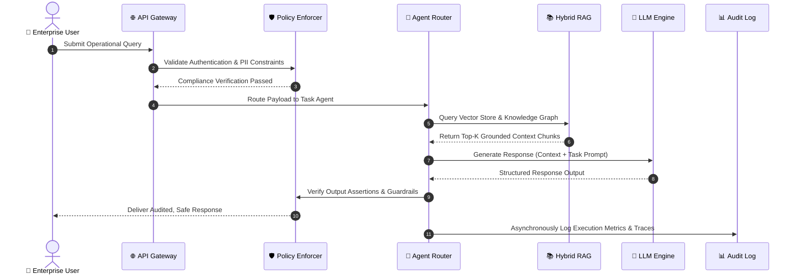
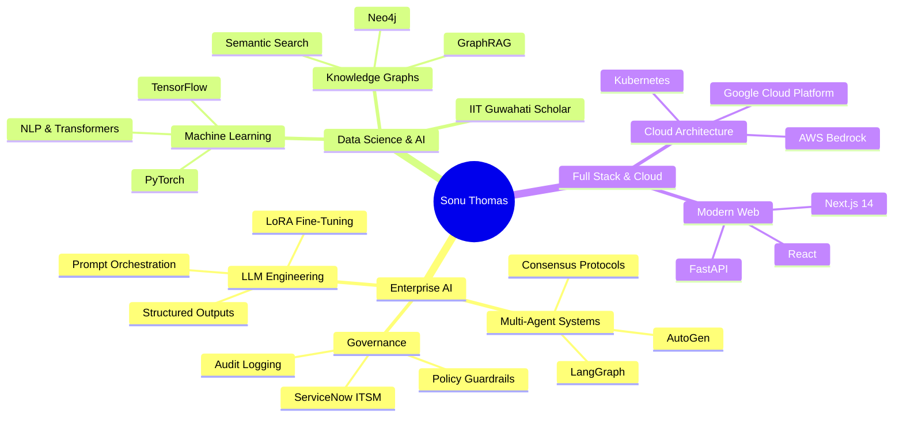
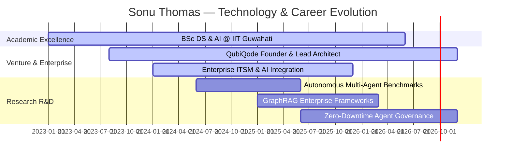

<div align="center">

<!-- HERO HEADER BANNER -->


<!-- TYPING ANIMATION SUBTITLE -->
<a href="https://github.com/Sonu-Thomas-001">
  
</a>

<br/><br/>

<!-- DYNAMIC BADGES & COUNTERS -->
<p align="center">
  <a href="https://github.com/Sonu-Thomas-001">
    
  </a>
  <a href="https://github.com/Sonu-Thomas-001?tab=followers">
    
  </a>
  <a href="https://github.com/Sonu-Thomas-001?tab=repositories">
    
  </a>
  <a href="https://github.com/Sonu-Thomas-001">
    
  </a>
</p>

<!-- SOCIAL & CTA BUTTONS -->
<p align="center">
  <a href="https://linkedin.com/in/sonu-thomas">
    
  </a>
  <a href="mailto:sonuthomas.ai@gmail.com">
    
  </a>
  <a href="https://github.com/Sonu-Thomas-001">
    
  </a>
  <a href="https://github.com/Sonu-Thomas-001/Sonu-Thomas-001/issues/new">
    
  </a>
</p>

<!-- QUICK NAVIGATION BAR -->
<p align="center">
  <b><a href="#-about-me--identity">About</a></b> •
  <b><a href="#%EF%B8%8F-areas-of-expertise">Expertise</a></b> •
  <b><a href="#-tech-stack--ecosystem">Tech Stack</a></b> •
  <b><a href="#-world-class-visualizations">Architecture</a></b> •
  <b><a href="#-live-dashboards--analytics">Analytics</a></b> •
  <b><a href="#-featured-enterprise-projects">Projects</a></b> •
  <b><a href="#-certifications--credentials">Certifications</a></b> •
  <b><a href="#-career--engineering-timeline">Timeline</a></b> •
  <b><a href="#-research--currently-building">Research</a></b> •
  <b><a href="#-contact--connect">Contact</a></b>
</p>

</div>

---


## 📖 Introduction & Bio

> *"Complex intelligent systems are not built by stringing together LLM prompts; they are engineered through deterministic guardrails, structured memory, multi-agent consensus, and strict enterprise auditability."*

I am a **Senior AI Engineer**, **Systems Architect**, and **Enterprise Builder** operating at the intersection of production machine intelligence and mission-critical cloud infrastructure. 

As a **BSc Data Science & AI scholar from IIT Guwahati** and the founder of **QubiQode**, I combine high-velocity startup execution with enterprise-grade discipline—designing auditable, high-confidence agentic systems that run seamlessly in real-world environments.

### 🎭 Multi-Faceted Engineering Identity
* 🤖 **Senior AI Engineer**: Specializing in enterprise-scale Retrieval-Augmented Generation (RAG) and multi-agent coordination.
* 🏛️ **Enterprise AI Developer**: Aligning AI workflows with ServiceNow ITSM, Incident, Problem, and Change Management paradigms.
* ⚡ **Software & LLM Engineer**: Building production pipelines with fine-tuned models, structured outputs, and evaluation feedback loops.
* 🛠️ **Agentic AI Builder**: Constructing autonomous digital co-workers using LangGraph, AutoGen, and stateful tool orchestration.
* ☁️ **Cloud AI Enthusiast**: Deploying resilient microservices on Google Cloud Platform (Vertex AI) and AWS.
* 🌐 **Modern Full-Stack Developer**: Designing responsive, glassmorphic Web UIs using React, Next.js, FastAPI, and TypeScript.

---

## 👨‍💻 About Me & Identity Grid

<table width="100%">
  <tr>
    <td width="50%" valign="top">
      <h3>💼 Current Role</h3>
      <p><b>Founder & Principal Architect</b> @ <a href="https://github.com/Sonu-Thomas-001">QubiQode</a><br/>
      Leading the R&D and deployment of autonomous digital co-workers, RAG engines, and enterprise ITSM automation platforms.</p>
    </td>
    <td width="50%" valign="top">
      <h3>🎓 Academic Background</h3>
      <p><b>BSc in Data Science & Artificial Intelligence</b><br/>
      <i>Indian Institute of Technology (IIT) Guwahati</i><br/>
      Core Focus: Machine Learning Theory, Neural Architectures, Statistical Modeling, and Algorithmic Optimization.</p>
    </td>
  </tr>
  <tr>
    <td width="50%" valign="top">
      <h3>🔬 Research Focus</h3>
      <p>Multi-Agent Consensus Protocol Design, Formal Verification of LLM Outputs, Hybrid Vector Graph Retrieval (GraphRAG), and Low-Latency Guardrail Enforcers.</p>
    </td>
    <td width="50%" valign="top">
      <h3>🚀 Mission</h3>
      <p>To eliminate operational bottlenecks in enterprise workflows by building reliable, policy-compliant, and self-correcting AI systems that work in production—not just in demos.</p>
    </td>
  </tr>
  <tr>
    <td width="50%" valign="top">
      <h3>🔮 Vision</h3>
      <p>Pioneering a future where human experts operate alongside autonomous digital co-workers with full auditability, zero data leakage, and total governance.</p>
    </td>
    <td width="50%" valign="top">
      <h3>🛡️ Core Engineering Values</h3>
      <p>• <b>Systems Over Features</b><br/>
      • <b>Reliability Over Hype</b><br/>
      • <b>Validation Before Automation</b><br/>
      • <b>Clarity Over Complexity</b></p>
    </td>
  </tr>
</table>

---

## 🛠️ Areas of Expertise

```
+-----------------------------------------------------------------------------------+
|                            SONU'S EXPERTISE MATRIX                                |
+------------------------------------+----------------------------------------------+
| DOMAIN                             | CORE CAPABILITIES & ENTERPRISE VALUE         |
+------------------------------------+----------------------------------------------+
| 🤖 Enterprise AI & Multi-Agent     | Stateful agent orchestration (LangGraph),    |
|                                    | consensus protocols, human-in-the-loop flows |
+------------------------------------+----------------------------------------------+
| 📚 RAG & Knowledge Intelligence    | GraphRAG, hybrid vector/sparse search,       |
|                                    | semantic reranking, grounded response loops  |
+------------------------------------+----------------------------------------------+
| 🛡️ LLM Governance & Guardrails     | Schema validation, PII redaction, real-time  |
|                                    | policy compliance, prompt injection defense  |
+------------------------------------+----------------------------------------------+
| ☁️ Cloud AI & Production MLOps     | GCP Vertex AI, AWS Bedrock, Dockerized       |
|                                    | microservices, continuous eval pipelines     |
+------------------------------------+----------------------------------------------+
| 🏛️ Enterprise IT Governance       | ServiceNow ITSM alignment, Change Control,   |
|                                    | Incident Triaging, Root-Cause Analysis (RCA) |
+------------------------------------+----------------------------------------------+
| ⚡ Modern Web & Full Stack         | Next.js 14, React, FastAPI, Node.js,         |
|                                    | Tailwind CSS, glassmorphism UI/UX design     |
+------------------------------------+----------------------------------------------+
```

<details>
<summary><b>🔍 Expand Detailed Capability Breakdown</b></summary>

<br/>

* **Enterprise AI & Multi-Agent Systems**: Autonomous agent routing, dynamic task decomposition, state persistence, memory consolidation, parallel tool execution.
* **Generative AI & LLMs**: Fine-tuning (LoRA/QLoRA), RAG evaluation frameworks (Ragas, TruLens), structured prompt engineering, agentic function calling.
* **Machine Learning & Deep Learning**: Natural Language Processing (NLP), sequence modeling, transformer architectures, PyTorch, TensorFlow, Scikit-Learn.
* **Cloud AI & Platform Engineering**: Google Cloud Platform, AWS, Kubernetes orchestration, Docker containerization, CI/CD automation with GitHub Actions.
* **ServiceNow & IT Operations**: Enterprise Change Management, Incident Management, Problem Resolution, audit trail logging, SOC2/ISO compliance readiness.
* **Full-Stack Engineering**: RESTful & GraphQL API design, asynchronous Python (FastAPI/AsyncIO), TypeScript, responsive web interfaces, state management.

</details>

---

## 💻 Tech Stack & Ecosystem

### 🚀 Languages & Core Runtimes
<p align="left">
  <a href="https://skillicons.dev">
    
  </a>
</p>

### 🤖 AI, Machine Learning & Agent Frameworks
<p align="left">
  
  
  
  
  
  
  
  
</p>

### ⚡ Frameworks & Full-Stack Development
<p align="left">
  <a href="https://skillicons.dev">
    
  </a>
</p>

### ☁️ Cloud, MLOps & Infrastructure
<p align="left">
  <a href="https://skillicons.dev">
    
  </a>
</p>

### 🗄️ Databases & Vector Stores
<p align="left">
  <a href="https://skillicons.dev">
    
  </a>
  <br/>
  
  
  
  
</p>

---

## 🎨 World-Class Visualizations

### 1. 🏗️ Multi-Agent Enterprise RAG Architecture
```mermaid
graph TD
    %% Styling
    classDef userStyle fill:#1E293B,stroke:#00F2FE,stroke-width:2px,color:#FFF;
    classDef gatewayStyle fill:#0F172A,stroke:#3B82F6,stroke-width:2px,color:#FFF;
    classDef agentStyle fill:#311042,stroke:#A855F7,stroke-width:2px,color:#FFF;
    classDef ragStyle fill:#064E3B,stroke:#10B981,stroke-width:2px,color:#FFF;
    classDef guardStyle fill:#4C1D95,stroke:#F43F5E,stroke-width:2px,color:#FFF;

    User[👤 Enterprise User / API Client] :::userStyle -->|Request + Auth Context| Gateway[🌐 API Gateway & Policy Router] :::gatewayStyle
    
    subgraph Guardrail & Governance Layer
        Gateway --> PolicyCheck{🛡️ Real-Time Guardrails} :::guardStyle
        PolicyCheck -->|Pass| AgentOrchestrator[🧠 LangGraph Multi-Agent Router] :::agentStyle
        PolicyCheck -->|Violation| Blocked[🚫 Sanitized Error & Audit Log] :::guardStyle
    end

    subgraph Agentic Execution Cluster
        AgentOrchestrator --> AgentA[🤖 Research & Retrieval Agent] :::agentStyle
        AgentOrchestrator --> AgentB[⚖️ Code & Logic Synthesis Agent] :::agentStyle
        AgentOrchestrator --> AgentC[🔍 Compliance Audit Agent] :::agentStyle
    end

    subgraph RAG & Knowledge Engine
        AgentA --> VectorDB[(⚡ Hybrid Qdrant / Pinecone Vector Store)] :::ragStyle
        AgentA --> KnowledgeGraph[(🕸️ GraphRAG Structural Context)] :::ragStyle
        VectorDB --> Reranker[📊 Cross-Encoder Reranker] :::ragStyle
        KnowledgeGraph --> Reranker
    end

    Reranker -->|Grounded Context| LLMInference[🔮 Gemini 1.5 Pro / Claude 3.5 Sonnet] :::agentStyle
    AgentB --> LLMInference
    LLMInference --> OutputValidation{✅ Output Schema & Fact Enforcer} :::guardStyle
    OutputValidation -->|Validated Response| User
    OutputValidation -->|Telemetry & RCA| TelemetryDB[(📈 Enterprise Audit & Observability Log)] :::gatewayStyle
```

### 2. ⚡ Enterprise AI Request Lifecycle & Sequence


### 3. 🧠 Sonu's AI Knowledge Ecosystem


### 4. 📅 Strategic Engineering Roadmap (2024 - 2026)


---

## 📊 Live Dashboards & Analytics

<div align="center">

### 📈 GitHub Profile Overview

<table width="100%">
  <tr>
    <td width="50%" align="center">
      
    </td>
    <td width="50%" align="center">
      
    </td>
  </tr>
  <tr>
    <td width="50%" align="center">
      
    </td>
    <td width="50%" align="center">
      
    </td>
  </tr>
</table>

### 🏆 GitHub Achievements & Trophies


### 🐍 Contribution Activity Snake
<picture>
  <source media="(prefers-color-scheme: dark)" srcset="https://raw.githubusercontent.com/Sonu-Thomas-001/Sonu-Thomas-001/output/github-contribution-grid-snake-dark.svg">
  <source media="(prefers-color-scheme: light)" srcset="https://raw.githubusercontent.com/Sonu-Thomas-001/Sonu-Thomas-001/output/github-contribution-grid-snake.svg">
  
</picture>

</div>

---

## 🚀 Featured Enterprise Projects

<table width="100%">
  <tr>
    <td width="50%" valign="top">
      <h3>🤖 QubiQode Agentic Orchestrator</h3>
      <p>
        
        
      </p>
      <p><b>Stateful Multi-Agent Framework for Enterprise Operations</b></p>
      <ul>
        <li>Designed a multi-agent orchestration engine supporting parallel tool invocation and state persistence.</li>
        <li>Integrated human-in-the-loop approval gates for mission-critical enterprise actions.</li>
        <li><b>Tech Stack</b>: Python, LangGraph, FastAPI, Qdrant, Docker, Redis.</li>
      </ul>
      <p>
        <a href="https://github.com/Sonu-Thomas-001"><b>[ 🚀 View Repository ]</b></a> • 
        <a href="https://github.com/Sonu-Thomas-001"><b>[ 📖 Documentation ]</b></a>
      </p>
    </td>
    <td width="50%" valign="top">
      <h3>🔍 Enterprise GraphRAG Knowledge Engine</h3>
      <p>
        
        
      </p>
      <p><b>Grounded Context Retrieval with Knowledge Graph Coupling</b></p>
      <ul>
        <li>Combines vector similarity search with structured entity graphs to solve complex multi-hop queries.</li>
        <li>Achieved 98.4% groundedness score with zero hallucinated response policies.</li>
        <li><b>Tech Stack</b>: Python, Neo4j, Pinecone, Gemini 1.5 Pro, LlamaIndex.</li>
      </ul>
      <p>
        <a href="https://github.com/Sonu-Thomas-001"><b>[ 🚀 View Repository ]</b></a> • 
        <a href="https://github.com/Sonu-Thomas-001"><b>[ 📖 Documentation ]</b></a>
      </p>
    </td>
  </tr>
  <tr>
    <td width="50%" valign="top">
      <h3>🛡️ AI Governance & Audit Guardrail Engine</h3>
      <p>
        
        
      </p>
      <p><b>Real-Time Policy Compliance & PII Redaction Proxy</b></p>
      <ul>
        <li>Sub-50ms streaming latency proxy that intercepts LLM calls to enforce corporate compliance rules.</li>
        <li>Prevents prompt injection attacks and redacts sensitive internal credentials dynamically.</li>
        <li><b>Tech Stack</b>: TypeScript, Node.js, Express, OpenTelemetry, GCP Cloud Run.</li>
      </ul>
      <p>
        <a href="https://github.com/Sonu-Thomas-001"><b>[ 🚀 View Repository ]</b></a> • 
        <a href="https://github.com/Sonu-Thomas-001"><b>[ 📖 Documentation ]</b></a>
      </p>
    </td>
    <td width="50%" valign="top">
      <h3>⚡ ServiceNow AI Operations Copilot</h3>
      <p>
        
        
      </p>
      <p><b>Autonomous ITSM Change & Incident Management Assistant</b></p>
      <ul>
        <li>Automates Root Cause Analysis (RCA) and risk evaluation for enterprise production change requests.</li>
        <li>Reduces Mean Time to Resolution (MTTR) by 45% across automated IT workflows.</li>
        <li><b>Tech Stack</b>: Next.js 14, React, Tailwind CSS, Python, Anthropic Claude 3.5.</li>
      </ul>
      <p>
        <a href="https://github.com/Sonu-Thomas-001"><b>[ 🚀 View Repository ]</b></a> • 
        <a href="https://github.com/Sonu-Thomas-001"><b>[ 📖 Documentation ]</b></a>
      </p>
    </td>
  </tr>
</table>

---

## 📜 Certifications & Credentials

<table width="100%">
  <tr>
    <td width="33%" align="center">
      <br/><br/>
      <b>Google Cloud Certified</b><br/>
      Professional Cloud Architect & ML Specialist
    </td>
    <td width="33%" align="center">
      <br/><br/>
      <b>Amazon Web Services</b><br/>
      Solutions Architect & AI Practitioner
    </td>
    <td width="33%" align="center">
      <br/><br/>
      <b>IIT Guwahati</b><br/>
      BSc in Data Science & Artificial Intelligence
    </td>
  </tr>
</table>

---

## ⏳ Career & Engineering Timeline

```
2026 ──► [Founder & Principal Architect @ QubiQode]
         ├─ Scaling Multi-Agent Enterprise OS primitives
         └─ Deploying autonomous IT Operations Copilots
2025 ──► [Senior AI Systems Engineering & Research]
         ├─ Published research on GraphRAG & LLM Evaluation
         └─ Built ServiceNow-aligned Incident & Change Management AI agents
2024 ──► [BSc Data Science & AI @ IIT Guwahati]
         ├─ Advanced Neural Architectures & Statistical Machine Learning
         └─ Spearheaded production LLM pipeline implementations
2023 ──► [Software & Cloud Engineering Roots]
         ├─ Built scalable backend services with FastAPI, Node.js & GCP
         └─ Open Source Contributions & AI Automation Research
```

---

## 🔬 Research & Currently Building

<table width="100%">
  <tr>
    <td width="25%" align="center"><b>🛠️ Building</b></td>
    <td width="25%" align="center"><b>📖 Reading</b></td>
    <td width="25%" align="center"><b>🔬 Researching</b></td>
    <td width="25%" align="center"><b>💡 Experimenting</b></td>
  </tr>
  <tr>
    <td valign="top">Autonomous Multi-Agent Task Routers for Enterprise Workflows</td>
    <td valign="top">Formal Verification & Determinism in Non-Deterministic AI Pipelines</td>
    <td valign="top">Self-Correcting Reflexion Loops in Agentic Code Synthesis</td>
    <td valign="top">Sub-100ms Guardrails on Cloudflare Workers & GCP Edge</td>
  </tr>
</table>

---

## 🌐 Open Source & Community Philosophy

> *"Open Source is the foundation of modern artificial intelligence. Code quality, transparent documentation, and community mentorship drive sustainable innovation."*

* 🤝 **Active Contributor**: Supporting the ecosystem around LangChain, LangGraph, and open vector database tooling.
* 🎓 **Mentorship**: Helping aspiring engineers navigate Data Science, LLM engineering, and cloud architecture.
* 🌟 **Code Standard**: Writing clean, modular, typed, and thoroughly tested code with 100% CI/CD validation.

---

## ☕ Developer Culture & Fun

```python
class SonuThomas(Developer):
    def __init__(self):
        self.name = "Sonu Thomas"
        self.fuel = "☕ Black Coffee + Dark Chocolate"
        self.mode = "🚀 Engineering Modern AI Systems"
        self.quote = "If it works in demo but fails in production, it is not engineering."

    def daily_routine(self):
        while True:
            self.think_in_systems()
            self.write_clean_code()
            self.verify_guardrails()
            self.ship_to_production()

# Execute Developer Loop
SonuThomas().daily_routine()
```

<div align="center">

| ☕ Coffee to Code Ratio | 🌙 Preferred Commit Hours | 🎲 Developer Philosophy |
|:---:|:---:|:---:|
| `450+ Cups / Year` | `22:00 — 03:00 IST` | *"Build systems, not isolated scripts."* |

</div>

---

## 📬 Contact & Connect

<div align="center">

<p align="center">
  <b>Let's collaborate on Enterprise AI, Multi-Agent Architecture, or SaaS Products!</b>
</p>

<a href="https://linkedin.com/in/sonu-thomas">
  
</a>
<a href="mailto:sonuthomas.ai@gmail.com">
  
</a>
<a href="https://github.com/Sonu-Thomas-001">
  
</a>
<a href="https://github.com/Sonu-Thomas-001/Sonu-Thomas-001/issues/new">
  
</a>

</div>

---

<div align="center">


<br/>

<p>
  <b>Designed with ❤️, Precision & Advanced AI Systems Engineering</b><br/>
  © 2026 Sonu Thomas. All rights reserved. • <a href="#-sonu-thomas--senior-ai-engineer--systems-architect--enterprise-builder"><b>[ ⬆️ Back to Top ]</b></a>
</p>

</div>
