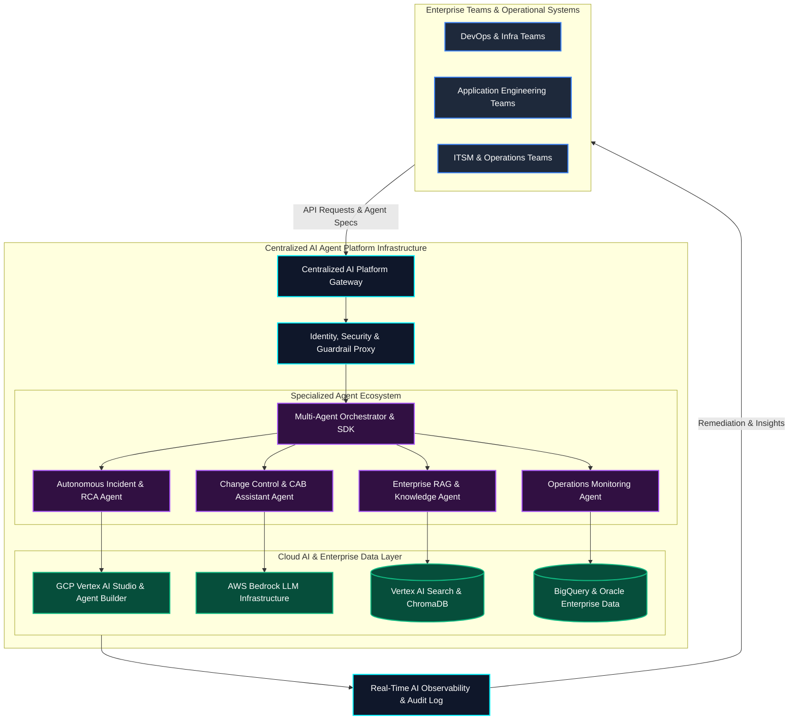
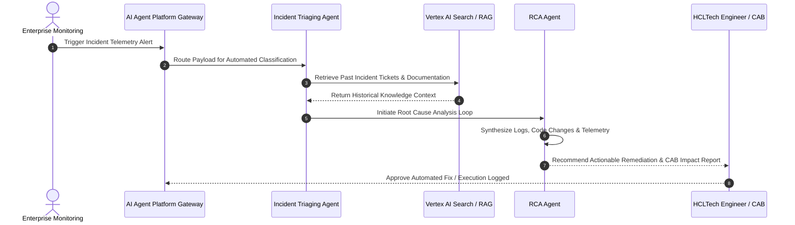
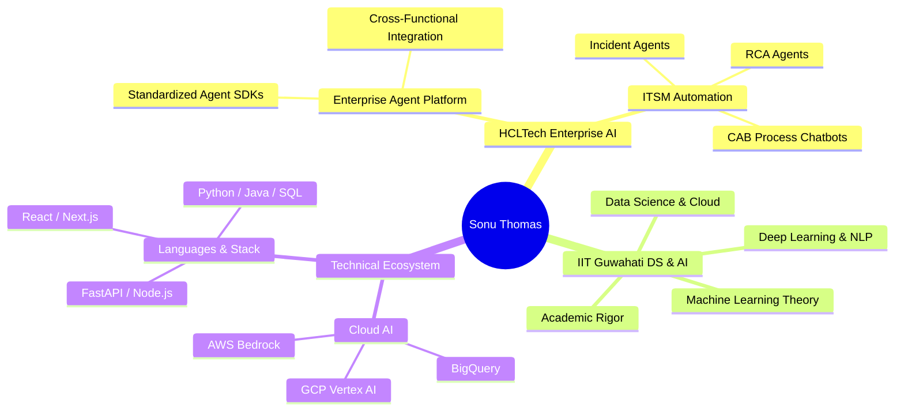
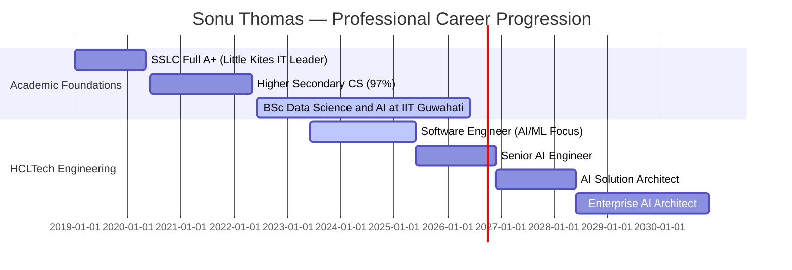

<div align="center">

<!-- HERO HEADER BANNER (ANIMATED SVG) -->


<!-- TYPING ANIMATION SUBTITLE -->
<a href="https://github.com/Sonu-Thomas-001">
  
</a>

<br/><br/>

<!-- DYNAMIC BADGES & COUNTERS -->
<p align="center">
  <a href="https://linkedin.com/in/sonu-thomas">
    
  </a>
  <a href="https://github.com/Sonu-Thomas-001">
    
  </a>
  <a href="https://iitg.ac.in">
    
  </a>
  <a href="https://komarev.com/ghpvc/?username=Sonu-Thomas-001&color=00F2FE&style=for-the-badge&label=PROFILE+VIEWS">
    
  </a>
</p>

<!-- SOCIAL & CTA BUTTONS -->
<p align="center">
  <a href="https://linkedin.com/in/sonu-thomas">
    
  </a>
  <a href="mailto:sonuthomas.ai@gmail.com">
    
  </a>
  <a href="https://github.com/Sonu-Thomas-001">
    
  </a>
  <a href="https://github.com/Sonu-Thomas-001/Sonu-Thomas-001/issues/new">
    
  </a>
</p>

<!-- QUICK NAVIGATION BAR -->
<p align="center">
  <b><a href="#introduction--bio">About</a></b> •
  <b><a href="#areas-of-expertise">Expertise</a></b> •
  <b><a href="#tech-stack--ecosystem">Tech Stack</a></b> •
  <b><a href="#architecture--system-visualizations">Architecture</a></b> •
  <b><a href="#live-dashboards--analytics">Analytics</a></b> •
  <b><a href="#featured-enterprise-projects">Projects</a></b> •
  <b><a href="#certifications--credentials">Certifications</a></b> •
  <b><a href="#career--education-timeline">Timeline</a></b> •
  <b><a href="#research--currently-building">Research</a></b> •
  <b><a href="#contact--connect">Contact</a></b>
</p>

</div>

---

<!-- ANIMATED LASER DIVIDER -->


## Introduction & Bio

<!-- ANIMATED LIVE STATUS TICKER -->
<p align="center">
  
</p>

<br/>

> *"Production-grade Enterprise AI is not about toy prompt demos; it is about building scalable, secure, and auditable agent infrastructure that empowers engineering teams to automate complex operational workflows safely."*

I am a **Software Engineer (AI/ML Specialist) at HCLTech**, **IIT Guwahati Scholar**, and **HCLTech Brand Ambassador** based in **Kannur, Kerala, India**. 

My core focus lies in **Enterprise AI Architecture**, **Agentic AI**, **Multi-Agent Systems**, and **AI Production Engineering**. At HCLTech, I work on large-scale enterprise AI initiatives—building resilient AI platforms, RAG systems, and autonomous digital workers that enable engineering teams to automate complex operational workflows safely.

### Engineering Identity & Leadership
*  **Software Engineer (AI/ML) @ HCLTech**: Designing enterprise-scale AI solutions, incident automation agents, and centralized developer platforms.
*  **B.Sc. (Honours) Data Science & AI @ IIT Guwahati**: Rigorous academic foundation in ML theory, statistics, deep learning, and large-scale AI systems.
*  **Agentic AI & Multi-Agent Specialist**: Orchestrating multi-agent collaboration with LangGraph, Google Vertex AI Agent Builder, and AWS Bedrock.
*  **Enterprise Operations & ITSM Alignment**: Integrating AI capabilities directly into Incident Management, Problem Resolution, Change Management, and CAB workflows.
*  **HCLTech Brand Ambassador & AI Club Core Team**: Leading community events, technical workshops, and developer initiatives across HCLTech.

---

## About Me & Profile Grid

<table width="100%">
  <tr>
    <td width="50%" valign="top">
      <h3></h3>
      <p><b>Software Engineer (AI/ML Specialist)</b> @ <a href="https://www.hcltech.com">HCLTech</a><br/>
      Working on enterprise-scale AI platforms, multi-agent systems, and production engineering initiatives.</p>
    </td>
    <td width="50%" valign="top">
      <h3></h3>
      <p><b>B.Sc. (Honours) Data Science & Artificial Intelligence</b><br/>
      <i>Indian Institute of Technology (IIT) Guwahati</i><br/>
      Core: Machine Learning, Deep Learning, Large-Scale AI Systems, Data Engineering & Cloud Computing.</p>
    </td>
  </tr>
  <tr>
    <td width="50%" valign="top">
      <h3></h3>
      <p><b>Kannur, Kerala, India</b><br/>
      <b>LinkedIn:</b> 6,000+ Followers & Active Technical Writer<br/>
      <b>HCLTech Brand Ambassador</b> & AI Club Core Team Member.</p>
    </td>
    <td width="50%" valign="top">
      <h3></h3>
      <p>To become a <b>Distinguished Enterprise AI Architect</b>, designing production-grade agentic platforms, self-healing operations, and secure digital workers for global organizations.</p>
    </td>
  </tr>
  <tr>
    <td width="50%" valign="top">
      <h3></h3>
      <p>• <b>Google Cloud Certified</b> Digital Leader (CDL) & Associate Cloud Engineer (ACE)<br/>
      • <b>3x AWS Certified</b> Professional & AI Specialist<br/>
      • <b>30+ Google Cloud Skill Badges</b> (Vertex AI Prompt Design, Data Science, MLOps)</p>
    </td>
    <td width="50%" valign="top">
      <h3></h3>
      <p>• <b>Production-Ready Over Demos</b><br/>
      • <b>Security-First AI Design</b><br/>
      • <b>Scalable Multi-Agent Infrastructure</b><br/>
      • <b>Measurable Business Impact & Automation</b></p>
    </td>
  </tr>
</table>

---

## Areas of Expertise

<!-- ANIMATED EXPERTISE RADAR SVGs -->
<p align="center">
  
</p>

<br/>

```
+-----------------------------------------------------------------------------------+
|                            SONU'S EXPERTISE MATRIX                                |
+------------------------------------+----------------------------------------------+
| DOMAIN                             | ENTERPRISE CAPABILITIES & IMPACT             |
+------------------------------------+----------------------------------------------+
| Enterprise AI & Multi-Agent        | Centralized agent platforms, multi-agent     |
|                                    | consensus, Vertex AI Agent Builder, LangGraph |
+------------------------------------+----------------------------------------------+
| RAG & Knowledge Intelligence       | Vertex AI Search, ChromaDB, enterprise       |
|                                    | document intelligence, hybrid vector search  |
+------------------------------------+----------------------------------------------+
| Enterprise ITSM Operations         | Automated Incident, Problem, RCA, Change     |
|                                    | Control, and CAB Process AI Copilots         |
+------------------------------------+----------------------------------------------+
| Cloud AI & Production MLOps        | GCP (Vertex AI Studio, BigQuery, GCS),       |
|                                    | AWS Bedrock, SageMaker, Docker, CI/CD        |
+------------------------------------+----------------------------------------------+
| Full Stack & Backend APIs          | Python, Java, FastAPI, Node.js, React,       |
|                                    | Next.js, Tailwind CSS, Framer Motion         |
+------------------------------------+----------------------------------------------+
```

<details>
<summary><b>Expand Detailed Capability Breakdown</b></summary>

<br/>

* **Enterprise AI & Multi-Agent Systems**: Autonomous agent routing, dynamic task decomposition, multi-agent observability platforms, centralized enterprise agent SDKs.
* **Large Language Models (LLM)**: Prompt engineering, RAG pipelines, long-context reasoning, tool calling, function calling, structured outputs, evaluation loops.
* **Cloud AI Platforms**: Google Cloud Platform (Vertex AI Studio, Agent Builder, Search, BigQuery), AWS (Bedrock, SageMaker).
* **Enterprise Operations & ITSM**: Incident Management, Problem Resolution, Root Cause Analysis (RCA), Change Management, Change Advisory Board (CAB) AI assistants.
* **Programming Languages & Frameworks**: Python, Java, SQL, PL/SQL, JavaScript, TypeScript, HTML/CSS, C++, JDBC, LangChain, LangGraph, Flask, Node.js.

</details>

---

## Tech Stack & Ecosystem

<!-- ANIMATED TECH MARQUEE BANNER -->
<p align="center">
  
</p>

<br/>

### Programming Languages
<p align="left">
  <a href="https://skillicons.dev">
    
  </a>
</p>

### AI, LLM & Agent Frameworks
<p align="left">
  
  
  
  
  
  
  
</p>

### Frontend & Backend Engineering
<p align="left">
  <a href="https://skillicons.dev">
    
  </a>
</p>

### Cloud Platforms & DevOps
<p align="left">
  <a href="https://skillicons.dev">
    
  </a>
</p>

### Databases & Data Stores
<p align="left">
  <a href="https://skillicons.dev">
    
  </a>
  <br/>
  
  
</p>

---

## Architecture & System Visualizations

<!-- ANIMATED ARCHITECTURE FLOW INDICATOR -->
<p align="center">
  
</p>

<br/>

### 1. Enterprise Multi-Agent AI Platform Architecture


### 2. Enterprise ITSM Incident & Root-Cause Analysis (RCA) Flow


### 3. AI & Engineering Ecosystem Mindmap


### 4. Career & Engineering Progression Roadmap


---

## Live Dashboards & Analytics

<div align="center">

### GitHub Profile Overview

<p align="center">
  
  
</p>

<p align="center">
  
  <a href="https://github.com/Sonu-Thomas-001">
    
  </a>
</p>

### GitHub Achievements & Trophies
<p align="center">
  
</p>

### Contribution Activity Snake
<picture>
  <source media="(prefers-color-scheme: dark)" srcset="https://raw.githubusercontent.com/Sonu-Thomas-001/Sonu-Thomas-001/output/github-contribution-grid-snake-dark.svg">
  <source media="(prefers-color-scheme: light)" srcset="https://raw.githubusercontent.com/Sonu-Thomas-001/Sonu-Thomas-001/output/github-contribution-grid-snake.svg">
  
</picture>

</div>

---

## Featured Enterprise Projects

<table width="100%">
  <tr>
    <td width="50%" valign="top">
      <h3>Enterprise AI Agent Platform & Governance</h3>
      <p>
        
        
      </p>
      <p><b>Unified Infrastructure for Enterprise AI Agent Development</b></p>
      <ul>
        <li>Architected a shared AI development platform enabling engineering teams to build, deploy, and monitor custom AI agents on centralized infrastructure.</li>
        <li>Standardized API gateways, guardrails, and telemetry for enterprise-wide deployment.</li>
        <li><b>Tech Stack</b>: Python, GCP Vertex AI, LangGraph, FastAPI, Docker, BigQuery.</li>
      </ul>
      <p>
        <a href="https://github.com/Sonu-Thomas-001"><b>[ View Details ]</b></a>
      </p>
    </td>
    <td width="50%" valign="top">
      <h3>Enterprise RAG & Knowledge Intelligence Engine</h3>
      <p>
        
        
      </p>
      <p><b>Context-Grounded Document Search & Intelligence</b></p>
      <ul>
        <li>Developed high-accuracy RAG pipelines using Vertex AI Search and ChromaDB for enterprise knowledge bases.</li>
        <li>Supported long-context reasoning, semantic document retrieval, and role-based access security.</li>
        <li><b>Tech Stack</b>: Python, Vertex AI Search, ChromaDB, LangChain, Gemini 1.5 Pro.</li>
      </ul>
      <p>
        <a href="https://github.com/Sonu-Thomas-001"><b>[ View Details ]</b></a>
      </p>
    </td>
  </tr>
  <tr>
    <td width="50%" valign="top">
      <h3>Multi-Agent Operations & Incident RCA System</h3>
      <p>
        
        
      </p>
      <p><b>Autonomous Incident Classification & Root-Cause Analysis</b></p>
      <ul>
        <li>Created multi-agent systems to monitor production telemetry, detect incidents, and recommend automated RCA.</li>
        <li>Significantly reduced Mean Time to Resolution (MTTR) for enterprise IT incident tickets.</li>
        <li><b>Tech Stack</b>: LangGraph, Python, AWS Bedrock, Node.js, Oracle.</li>
      </ul>
      <p>
        <a href="https://github.com/Sonu-Thomas-001"><b>[ View Details ]</b></a>
      </p>
    </td>
    <td width="50%" valign="top">
      <h3>Enterprise Change Management & CAB Chatbot</h3>
      <p>
        
        
      </p>
      <p><b>Automated ITIL Change Request & Documentation Assistant</b></p>
      <ul>
        <li>Designed an intelligent assistant for Change Advisory Board (CAB) review workflows and automated documentation.</li>
        <li>Empowered employees and risk managers with immediate policy verification.</li>
        <li><b>Tech Stack</b>: Next.js, React, Tailwind CSS, Python, Anthropic Claude.</li>
      </ul>
      <p>
        <a href="https://github.com/Sonu-Thomas-001"><b>[ View Details ]</b></a>
      </p>
    </td>
  </tr>
</table>

---

## Certifications & Credentials

<!-- ANIMATED CERTIFICATIONS STRIP -->
<p align="center">
  
</p>

<br/>

<table width="100%">
  <tr>
    <td width="33%" align="center">
      <br/><br/>
      <b>Google Cloud Certified</b><br/>
      Digital Leader (CDL) & Associate Cloud Engineer (ACE)<br/>
      <i>30+ Google Cloud Skill Badges</i>
    </td>
    <td width="33%" align="center">
      <br/><br/>
      <b>Amazon Web Services</b><br/>
      3x AWS Certified Practitioner & AI Specialist
    </td>
    <td width="33%" align="center">
      <br/><br/>
      <b>IIT Guwahati</b><br/>
      B.Sc. (Honours) Data Science & Artificial Intelligence
    </td>
  </tr>
</table>

---

## Career & Education Timeline

<!-- ANIMATED TIMELINE PROGRESSION BAR -->
<p align="center">
  
</p>

<br/>

```
2026+ ──► [Target Roadmap: Senior AI Engineer ➔ AI Solution Architect]
          └─ Designing scalable enterprise agent platforms & AI governance
2023+ ──► [Software Engineer (AI/ML) @ HCLTech]
          ├─ Enterprise AI Platforms, Multi-Agent Systems & Operational RAG
          ├─ HCLTech Brand Ambassador & AI Club Core Team
          └─ Incident Management, Change Control & RAG Pipelines
2022+ ──► [B.Sc. (Honours) Data Science & AI @ IIT Guwahati]
          └─ Specializing in Machine Learning, Deep Learning & Cloud AI
2022  ──► [Higher Secondary CS — 97%]
          └─ Computer Science Society Leader & Technical Club
2020  ──► [SSLC — Full A+]
          └─ Little Kites IT Club Leader & Scouts
```

---

## Research & Currently Building

<!-- ANIMATED RESEARCH LAB TICKER -->
<p align="center">
  
</p>

<br/>

<table width="100%">
  <tr>
    <td width="25%" align="center"><b>Building</b></td>
    <td width="25%" align="center"><b>Reading</b></td>
    <td width="25%" align="center"><b>Researching</b></td>
    <td width="25%" align="center"><b>Experimenting</b></td>
  </tr>
  <tr>
    <td valign="top">Centralized Enterprise AI Agent SDKs & Developer Frameworks</td>
    <td valign="top">LLM Security, Guardrails & Distributed AI Infrastructure</td>
    <td valign="top">Multi-Agent Consensus & Self-Healing IT Operations</td>
    <td valign="top">Vertex AI Agent Builder Custom Tool Calling & Vector Pipelines</td>
  </tr>
</table>

---

## Developer Culture & Engineering Mindset

<!-- ANIMATED COFFEE TO CODE WIDGET -->
<p align="center">
  
</p>

<br/>

```python
class SonuThomas(Developer):
    def __init__(self):
        self.name = "Sonu Thomas"
        self.role = "Software Engineer (AI/ML) @ HCLTech"
        self.education = "BSc Data Science & AI @ IIT Guwahati"
        self.location = "Kannur, Kerala, India"
        self.linkedin_followers = "6,000+"
        self.philosophy = "Production-ready implementations over short-lived demos."

    def engineering_loop(self):
        while True:
            self.design_enterprise_architecture()
            self.build_agentic_systems()
            self.ensure_security_and_governance()
            self.empower_engineering_teams()

# Execute Career Loop
SonuThomas().engineering_loop()
```

<div align="center">

| Coffee to Code | Location | LinkedIn Network | Engineering Philosophy |
|:---:|:---:|:---:|:---:|
| `Black Coffee` | `Kannur, Kerala, India` | `6,000+ Followers` | *"Build systems that scale to operations."* |

</div>

---

## Contact & Connect

<!-- ANIMATED CONTACT BANNER -->
<p align="center">
  
</p>

<br/>

<div align="center">

<p align="center">
  <b>Connect with me for discussions on Enterprise AI, Multi-Agent Architecture, and Cloud Engineering!</b>
</p>

<a href="https://linkedin.com/in/sonu-thomas">
  
</a>
<a href="mailto:sonuthomas.ai@gmail.com">
  
</a>
<a href="https://github.com/Sonu-Thomas-001">
  
</a>
<a href="https://github.com/Sonu-Thomas-001/Sonu-Thomas-001/issues/new">
  
</a>

</div>

---

<div align="center">

<!-- ANIMATED LASER FOOTER DIVIDER -->


<br/>

<p>
  <b>Designed with Precision & Enterprise AI Engineering Mindset</b><br/>
  © 2026 Sonu Thomas. All rights reserved. • <a href="#sonu-thomas"><b>[ Back to Top ]</b></a>
</p>

</div>
